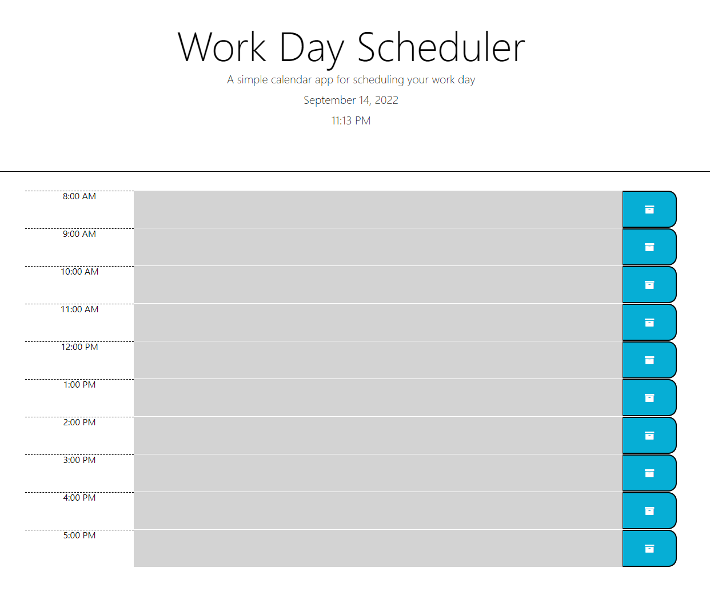
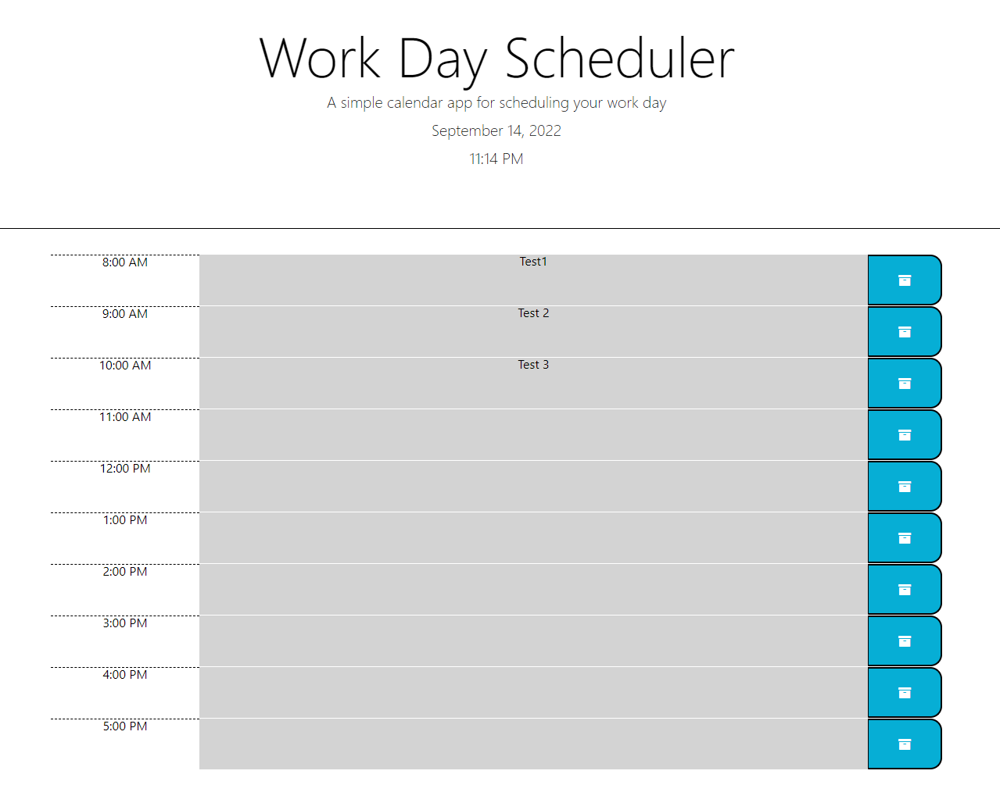

# Work-Day-Scheduler

### This scheduler application was created by HTML, CSS, and Javascript. Third party API (jQuery and moment) were also utilised.

### This workday scheduler demostrate below functionalities:

1. Showing the current date and time as reference and comparison,
2. Allow users to plan and record tasks within the hours blocks,
3. Workday hours are between 8am and 5pm,
4. Allow user to save the inputs when clicking the "save" button, inputs will remain when user refresh the page,
5. The scheduler table is colour coded to visulise the tracking of time, the background color for past event is grey, orange for present, and green for future hours within the same workday.

---

### This project has been deployed to GitHub Pages and the link is as below

[Workday Scheduler URL](https://kittenknight06.github.io/Work-Day-Scheduler/)

## The cover page is shown as below

---

### - When clicking the input area on the right side of the hours (i.e. 8:00 AM), user can then type the activities/tasks. 

### - When user finishes typing the words, and then click the "save button" on the right for each of the rows that requires saving, the input will then be saved and remain when user refresh the page.

### Given that the time of the screenshot was at 11:14 PM and all hours on the table were "past hours", therefore the background color of the rows are grey.